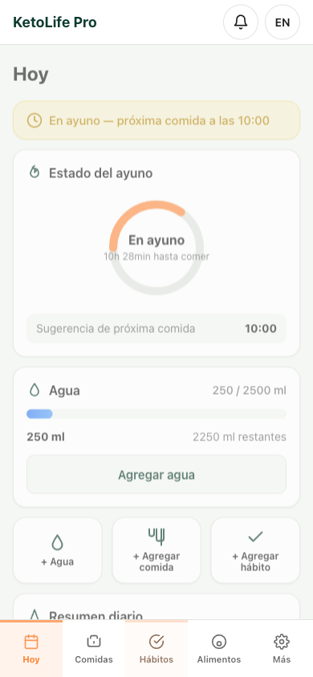
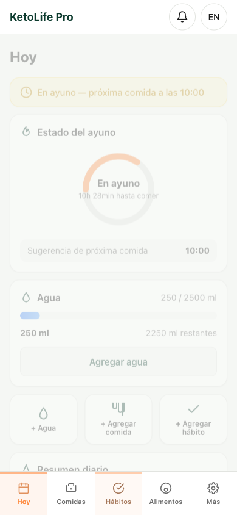
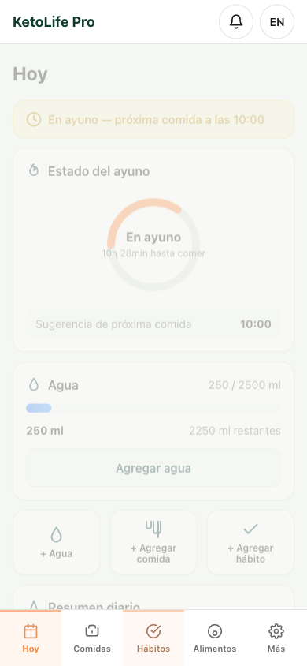
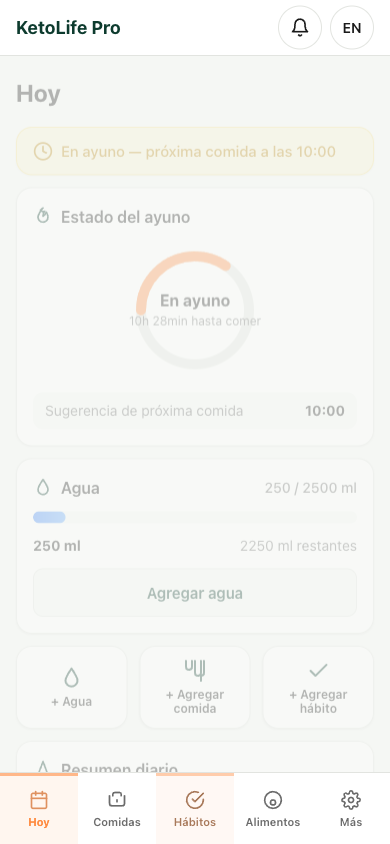
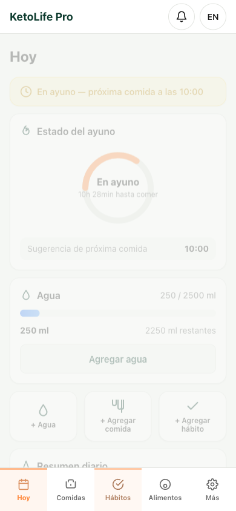
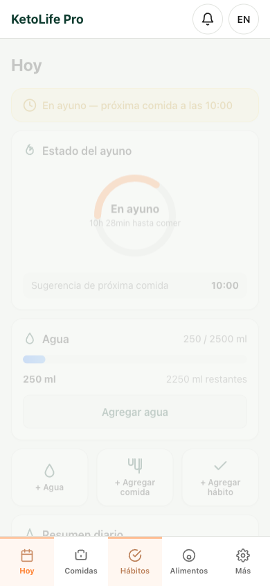
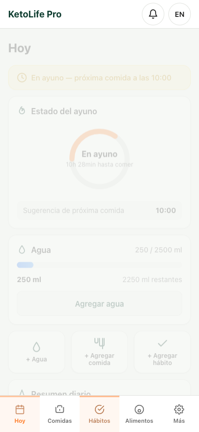

# KetoLife Pro — Simulación de 15 días

| Día | Fecha | Dashboard |
|----:|-------|-----------|
| 1 | 2026-07-07 |  |
| 2 | 2026-07-08 |  |
| 3 | 2026-07-09 |  |
| 4 | 2026-07-10 |  |
| 5 | 2026-07-11 |  |
| 6 | 2026-07-12 |  |
| 7 | 2026-07-13 |  |
| 8 | 2026-07-14 |  |
| 9 | 2026-07-15 |  |
| 10 | 2026-07-16 |  |
| 11 | 2026-07-17 |  |
| 12 | 2026-07-18 |  |
| 13 | 2026-07-19 |  |
| 14 | 2026-07-20 |  |
| 15 | 2026-07-21 |  |

## Métricas finales

- Días simulados: **15**
- Comidas registradas: **15** (1 por día)
- Registros de agua: **15** (1 por día)
- Hábitos completados: **15** (1 por día)

## Flujo automatizado por día

1. Fijar `localStorage.ketoSimDate` a las 12:00 del día simulado.
2. Refrescar la app.
3. Desde el dashboard **Hoy**, agregar 250 ml de agua.
4. Navegar a **Comidas** y registrar una comida keto (13:00, 8g net carbs, 25g proteína, 40g grasa, 3g fibra).
5. Navegar a **Hábitos** y completar el primer hábito.
6. Volver al dashboard y capturar pantalla.
7. Verificar al final que IndexedDB contiene 15 comidas y 15 registros de agua.

## Notas técnicas

- La simulación se ejecutó con Playwright en Chromium con viewport móvil (390 × 844).
- El mock de tiempo centralizado en `localStorage.ketoSimDate` permite avanzar día a día sin depender de la fecha real del sistema.
- El test se ejecutó satisfactoriamente contra la URL de producción `https://mariobustosjmz.github.io/keto-life-pro/`.
- Ajustes incluidos en este entregable: reemplazo de emojis restantes por SVG, corrección del parseo de fecha en `TimeEngine.getToday()`, y defensas en `habits.js` para entornos sin `window.notifications`.
